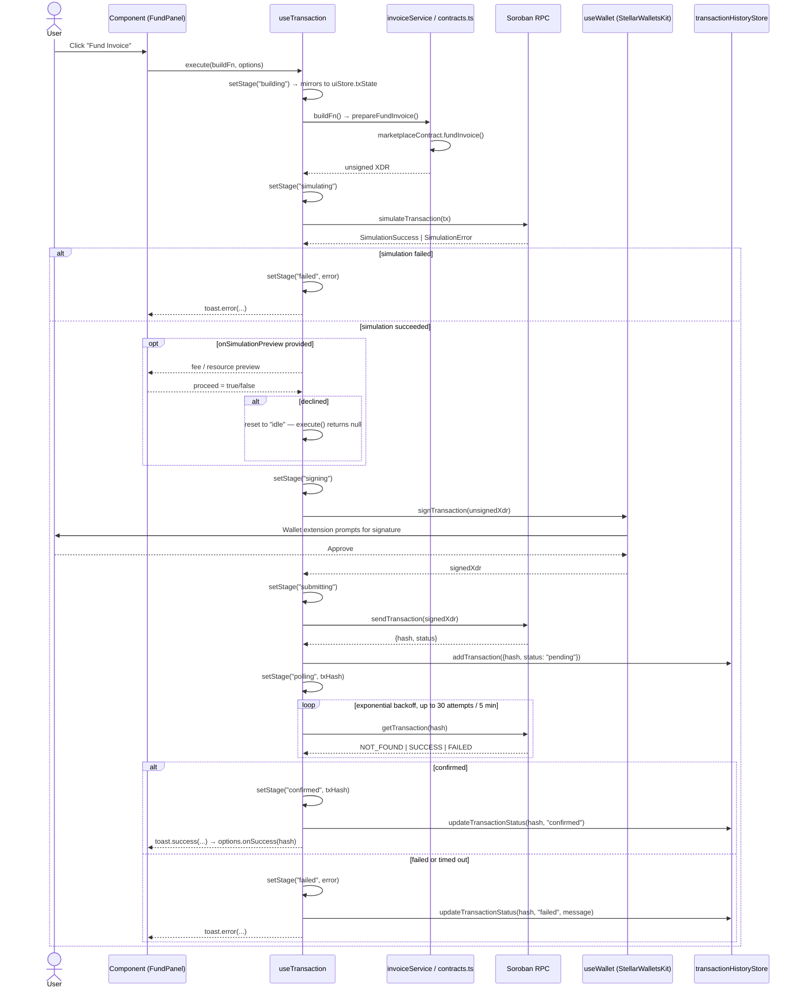

# Kora Protocol — Architecture

This document describes the technical architecture of the Kora Protocol frontend: how it is structured, how data flows, and how it integrates with Stellar Soroban.

---

## Table of Contents

- [High-Level Overview](#high-level-overview)
- [Layer Breakdown](#layer-breakdown)
- [Data Flow](#data-flow)
- [State Management](#state-management)
- [Wallet Integration](#wallet-integration)
- [Contract Interaction](#contract-interaction)
- [Transaction Lifecycle Deep Dive](#transaction-lifecycle-deep-dive)
- [IPFS Storage](#ipfs-storage)
- [Rendering Strategy](#rendering-strategy)
- [Security Considerations](#security-considerations)
- [Scalability Notes](#scalability-notes)

---

## High-Level Overview

```
┌─────────────────────────────────────────────────────────────────┐
│                        Browser (Client)                         │
│                                                                 │
│  ┌──────────────┐  ┌──────────────┐  ┌──────────────────────┐  │
│  │  Next.js App │  │  Zustand     │  │  TanStack Query      │  │
│  │  (App Router)│  │  (UI State)  │  │  (Server State)      │  │
│  └──────┬───────┘  └──────┬───────┘  └──────────┬───────────┘  │
│         │                 │                      │              │
│  ┌──────▼─────────────────▼──────────────────────▼───────────┐  │
│  │                    Service Layer                           │  │
│  │  invoiceService.ts  ·  ipfs.ts  ·  stellar/contracts.ts   │  │
│  └──────────────────────────┬──────────────────────────────┘  │
└─────────────────────────────┼───────────────────────────────────┘
                              │
          ┌───────────────────┼───────────────────┐
          │                   │                   │
   ┌──────▼──────┐   ┌────────▼───────┐   ┌──────▼──────┐
   │  Soroban    │   │  Stellar       │   │  Pinata     │
   │  RPC Node   │   │  Horizon API   │   │  IPFS       │
   └─────────────┘   └────────────────┘   └─────────────┘
```

---

## Layer Breakdown

### 1. Presentation Layer (`app/`, `components/`)

- **Next.js App Router** pages handle routing and layout.
- **Server Components** are used for static/SEO content (landing page sections).
- **Client Components** (`"use client"`) handle interactivity: wallet connection, forms, charts.
- **`components/ui/`** — headless, reusable primitives (Button, Card, Input, etc.) built on Radix UI.
- **`components/invoice/`** — domain-specific components (InvoiceCard).
- **`components/wallet/`** — wallet connection UI.
- **`components/layout/`** — Navbar, shared layout elements.

### 2. Hook Layer (`hooks/`)

Hooks encapsulate all stateful logic and side effects:

| Hook | Responsibility |
|------|---------------|
| `useWallet` | Wraps Stellar Wallets Kit; exposes connect/disconnect/sign |
| `useTransaction` | Manages the full tx lifecycle with toast notifications |
| `useInvoices` | TanStack Query wrappers for invoice data fetching |

### 3. Service Layer (`services/`)

Pure functions that abstract data access:

| Service | Responsibility |
|---------|---------------|
| `invoiceService.ts` | Fetch invoices, prepare mint/fund transactions |
| `mockData.ts` | Static mock data for development |

The service layer is the **only** place that calls `lib/stellar/` or `lib/ipfs.ts`. Components never call these directly.

### 4. Library Layer (`lib/`)

Low-level utilities and clients:

| Module | Responsibility |
|--------|---------------|
| `lib/stellar/client.ts` | Soroban RPC + Horizon singletons |
| `lib/stellar/contracts.ts` | Contract call builders (unsigned XDR) |
| `lib/ipfs.ts` | Pinata upload helpers |
| `lib/utils.ts` | Formatting, class merging, constants |
| `lib/validations/` | Zod schemas for form validation |

### 5. State Layer (`store/`)

Zustand stores for global client state:

| Store | State |
|-------|-------|
| `walletStore` | Wallet address, connection status, balances (persisted to localStorage) |
| `invoiceStore` | Marketplace filters, sort, search query |
| `uiStore` | Modal open/close, transaction status |

---

## Data Flow

### Read Flow (Marketplace)

```
User visits /marketplace
    │
    ▼
useInvoices() [TanStack Query]
    │
    ▼
fetchInvoices(filters, sort) [invoiceService.ts]
    │
    ├── MOCK_DATA=true → return MOCK_INVOICES (filtered/sorted)
    │
    └── MOCK_DATA=false → fetch from on-chain indexer / Soroban RPC
    │
    ▼
InvoiceCard components render
```

### Write Flow (Fund Invoice)

```
User clicks "Fund Invoice"
    │
    ▼
handleFund() in [id]/page.tsx
    │
    ▼
useTransaction().execute(buildFn)
    │
    ├── buildFn() → prepareFundInvoice() [invoiceService.ts]
    │                   └── marketplaceContract.fundInvoice() [contracts.ts]
    │                           └── buildContractCall() → unsigned XDR
    │
    ├── signTransaction(xdr) [useWallet → StellarWalletsKit]
    │       └── Wallet extension prompts user
    │
    └── submitAndConfirm(signedXdr) [invoiceService.ts]
            ├── submitTransaction() [client.ts → Soroban RPC]
            └── waitForTransaction() [polls until confirmed]
    │
    ▼
Toast notification + UI update
```

---

## State Management

We use **two separate state systems** for different concerns:

### Server State — TanStack Query

- Invoice listings, individual invoice data
- Automatic background refetching, caching, deduplication
- Cache keys: `["invoices", filters, sort]`, `["invoice", id]`

### Client State — Zustand

- **walletStore**: Persisted to `localStorage` via `zustand/middleware/persist`. Survives page refresh.
- **invoiceStore**: Ephemeral marketplace filter/sort state.
- **uiStore**: Ephemeral modal and transaction status.

**Rule:** Never put server data in Zustand. Never put UI state in TanStack Query.

---

## Wallet Integration

Kora uses [`@creit.tech/stellar-wallets-kit`](https://github.com/Creit-Tech/Stellar-Wallets-Kit) to support multiple Stellar wallets through a unified API.

```
useWallet hook
    │
    ▼
StellarWalletsKit (singleton)
    │
    ├── Freighter (browser extension)
    ├── xBull (browser extension)
    ├── LOBSTR (browser extension)
    └── Albedo (web-based signer)
```

The kit is instantiated lazily on first use and reused across the session. On disconnect, the singleton is cleared.

**Wallet state persistence:** The wallet address and provider are persisted to `localStorage`. On page load, if a stored address exists, the UI shows as connected — but the actual kit session must be re-established on the next transaction (the wallet extension handles this transparently).

---

## Contract Interaction

All Soroban contract interactions follow this pattern:

```typescript
// 1. Build (client-side, no signature needed)
const tx = await buildContractCall({ contractId, method, args, sourcePublicKey });
// → Simulates the transaction to get resource footprint
// → Returns an assembled Transaction object

// 2. Serialize to XDR for wallet signing
const unsignedXdr = tx.toXDR();

// 3. Sign (wallet extension)
const signedXdr = await walletKit.signTransaction(unsignedXdr, { ... });

// 4. Submit
const result = await rpc.sendTransaction(tx);

// 5. Confirm (poll)
const confirmed = await waitForTransaction(result.hash);
```

This separation means the frontend **never holds private keys**. The wallet extension is the only signer.

---

## Transaction Lifecycle Deep Dive

Every write operation (mint, fund, repay, claim yield) goes through the same
hook: `useTransaction`. This section traces a single call through
`execute()` end to end, and documents the `TxState` machine it drives.

### Actors

| Actor | Role |
|-------|------|
| `useTransaction` | Owns the lifecycle. Holds local React state (source of truth for the calling component) and mirrors it into `uiStore`. |
| `walletStore` | Read-only from the tx lifecycle's perspective. Supplies nothing directly — `useWallet` reads/writes it for connection state, and `useTransaction` only consumes `signTransaction`/`publicKey` from `useWallet`. |
| `uiStore` | Holds `txState`, a globally-readable mirror of the current stage. Lets UI outside the initiating component (e.g. a persistent status indicator) react without prop drilling. |
| `transactionHistoryStore` | Records every submitted transaction (`pending` → `confirmed`/`failed`) for the Transaction History page. Written to only after a hash exists, i.e. from `submitting` onward. |
| Soroban RPC | Simulates, submits, and is polled for confirmation. |

### Sequence: Fund Invoice



Every `setStage()` call does two things: it updates `useTransaction`'s local
`useState` (what the calling component reads to disable buttons / show
spinners) and calls `uiStore.setTxState()` with the same status, so any
other part of the tree can observe tx progress. For in-progress stages
(`building`, `simulating`, `signing`, `submitting`, `polling`) it also
drives a single loading toast (`TOAST_ID = "kora-tx"`), which is replaced
in place by the final success/error toast rather than stacking.

### The `TxState` machine

```mermaid
stateDiagram-v2
    [*] --> idle
    idle --> building: execute(buildFn) called
    building --> simulating: real transaction (not a "mock_" XDR)
    building --> signing: mock XDR — simulation skipped (demo / test mode)
    simulating --> failed: simulateTransaction() returns an error
    simulating --> idle: onSimulationPreview resolves false (caller declines)
    simulating --> signing: simulation succeeds (preview optionally confirmed by caller)
    signing --> failed: wallet rejects, or signTransaction() throws
    signing --> submitting: signedXdr obtained
    submitting --> failed: sendTransaction() returns status "ERROR"
    submitting --> polling: hash received; recorded in transactionHistoryStore as "pending"
    polling --> confirmed: getTransaction() returns "SUCCESS"
    polling --> failed: getTransaction() returns "FAILED", or the 30-attempt / 5-minute timeout elapses
    confirmed --> idle: reset() — component starts a new tx or unmounts
    failed --> idle: reset() — via the error toast's dismiss action, or a new tx attempt
```

`TxLifecycleStatus` (in `useTransaction.ts`) also defines a `retrying`
status, reserved for recovering from `BadSequenceError` (thrown by
`submitTransaction` in `lib/stellar/client.ts` when the network reports
`tx_bad_seq`). When set, it is mirrored to `uiStore.txState` as
`"submitting"` rather than a new state, since `TxState` (in
`types/contract.ts`) doesn't define a `retrying` variant — shared UI that
only reads `uiStore.txState` doesn't need to special-case it. Note this
mapping happens in code but nothing in `execute()` currently drives a
transition into `retrying`; treat it as a documented extension point for
sequence-number retry handling, not a path exercised by the flow above.

### Store responsibilities at each stage

| Stage | `uiStore.txState` | `transactionHistoryStore` | Toast |
|-------|--------------------|-----------------------------|-------|
| `idle` | `{ status: "idle" }` | — | dismissed |
| `building` / `simulating` / `signing` | mirrors status | — | loading |
| `submitting` | mirrors status | — | loading |
| `polling` | `{ status: "polling", txHash }` | `addTransaction({ hash, status: "pending", ... })` | loading |
| `confirmed` | `{ status: "confirmed", txHash }` | `updateTransactionStatus(hash, "confirmed")` | success |
| `failed` | `{ status: "failed", error, txHash? }` | `updateTransactionStatus(hash, "failed", message)` if a hash exists | error, with a dismiss action that calls `reset()` |

`walletStore` is never written to by `useTransaction`. It only supplies
`publicKey` and `signTransaction` (via `useWallet`) for the `signing`
stage — wallet connection state changes independently, through
`useWallet`'s own connect/disconnect flow.

---

## IPFS Storage

Invoice documents and metadata are stored on IPFS via Pinata:

```
Create Invoice flow
    │
    ├── uploadFileToPinata(pdf) → docCid
    │
    ├── Build metadata JSON { ...invoiceData, documentHash: docCid }
    │
    └── uploadJsonToPinata(metadata) → metadataCid
            │
            └── metadataCid passed to mint_invoice() on-chain
```

The on-chain NFT stores only the IPFS CID. The full metadata is always retrievable from IPFS, making it tamper-proof and permanent.

---

## Rendering Strategy

| Page | Strategy | Reason |
|------|----------|--------|
| `/` (Landing) | Static + Client hydration | SEO, animations |
| `/marketplace` | Client | Dynamic filters, wallet state |
| `/marketplace/[id]` | SSR/ISR + Client | Server `generateMetadata` + JSON-LD/OG from IPFS; client fund panel |
| `/invoice/create` | Client | Form, file upload, wallet |
| `/dashboard/sme` | Client | Wallet-gated |
| `/dashboard/investor` | Client | Wallet-gated |
| `/analytics` | Client | Charts, wallet-gated |

Most interactive pages are client-rendered because they require wallet state. Invoice detail pages use SSR/ISR for SEO: `generateMetadata` hydrates OG tags from invoice + IPFS metadata, server-rendered JSON-LD, SVG Open Graph previews, and sitemap entries for `/marketplace/[id]`.

---

## Security Considerations

1. **No private keys in the frontend.** All signing is delegated to wallet extensions.
2. **Environment variables.** Only `NEXT_PUBLIC_*` variables are exposed to the browser. `PINATA_JWT` is server-only and used only in API routes (not yet implemented — currently called client-side for simplicity; move to API route before production).
3. **Input validation.** All form inputs are validated with Zod before any contract call is built.
4. **IPFS content addressing.** Invoice documents are content-addressed — the CID stored on-chain is a cryptographic hash of the content, making tampering detectable.
5. **Contract simulation.** Every transaction is simulated before signing. Simulation errors surface to the user before they're asked to sign.
6. **No custodial funds.** The frontend never holds or transfers user funds directly. All value flows through Soroban smart contracts.

---

## Scalability Notes

- **Indexer:** For production, replace `fetchInvoices` with a dedicated indexer (e.g., a Soroban event indexer or a custom backend) rather than querying the RPC directly for listings.
- **Pagination:** The service layer already supports `page` and `pageSize` parameters. The marketplace UI can be extended with infinite scroll or pagination controls.
- **Caching:** TanStack Query's `staleTime` is set to 30s for listings and 60s for individual invoices. Adjust based on on-chain update frequency.
- **Multi-network:** The network is read from `NEXT_PUBLIC_STELLAR_NETWORK`. Switching to mainnet requires only an environment variable change and redeployment.

---

## Deployment & CI

- **Build:** The project builds with `next build` and is deployed as a static/SSR hybrid depending on the hosting platform.
- **CI:** CI should run `pnpm install --frozen-lockfile`, `pnpm lint`, and `pnpm test` (if tests exist) before publishing artifacts.
- **Secrets:** Use the hosting provider's secret store for server-only variables (e.g., `PINATA_JWT`, private indexer keys). Do not expose them as `NEXT_PUBLIC_*`.

### Web Vitals regression gate

`e2e/performance.spec.ts` runs two performance checks, and they are gated
differently on purpose:

| Check | Measures | CI behaviour |
|---|---|---|
| Marketplace load test | Wall-clock timings of a scripted scroll | **Warn only** — too noisy on shared runners to block a merge |
| Web Vitals gate | Browser-reported LCP, CLS, TTFB, FCP for one page load | **Fails the build** |

The gate is **relative, not absolute**. `VITAL_THRESHOLDS` in `lib/webVitals.ts`
already answers *"is this page fast enough"*, but a PR can double LCP while
staying comfortably under 2500 ms and nothing would notice until it crosses the
bar months later. `evaluateVitalsRegression()` instead compares each run against
the `webVitals` block in [`performance-baseline.json`](performance-baseline.json)
and fails when a metric grew by more than **10%**.

To keep the false-positive rate survivable on shared CI hardware, a metric must
breach **both** a proportional and an absolute floor (`REGRESSION_MIN_DELTA`).
A TTFB moving 8 ms → 9 ms is +12.5% but is indistinguishable from runner noise,
so it does not fail. Metrics absent from either the run or the baseline are
skipped rather than failed — but a run where *nothing* could be compared fails
too, since that means the collector broke rather than that everything passed.

#### Updating the baseline

When a change makes a metric legitimately slower — a deliberate trade-off, a new
above-the-fold feature — update the baseline rather than loosening the threshold:

```bash
UPDATE_VITALS_BASELINE=true npx playwright test e2e/performance
```

Then commit the regenerated `performance-baseline.json` **in the same PR**, and
say in the description why the regression is acceptable.

> **Never** update the baseline on `main` to turn a red build green. That
> silently ratchets the budget upward and defeats the point of the gate.

The same spec also POSTs its measurements to `/api/vitals`, so the ingest
endpoint gets synthetic traffic on every CI run and a broken handler surfaces in
CI instead of silently dropping real user metrics in production.

## Appendix / Glossary

- **Soroban:** Stellar's smart contract platform.
- **Horizon:** Stellar's REST API for account and ledger data.
- **CID:** Content Identifier for IPFS objects.

## Contact

For architecture questions or proposals, open an issue or contact the core maintainers in the repository.
